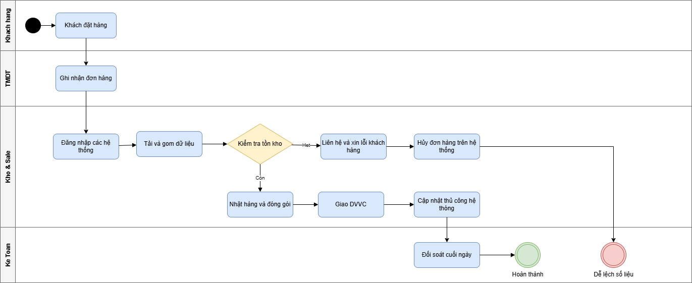
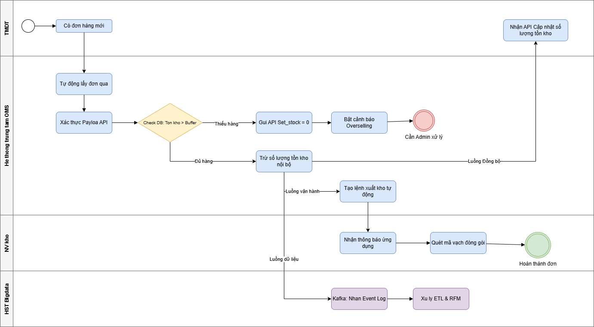
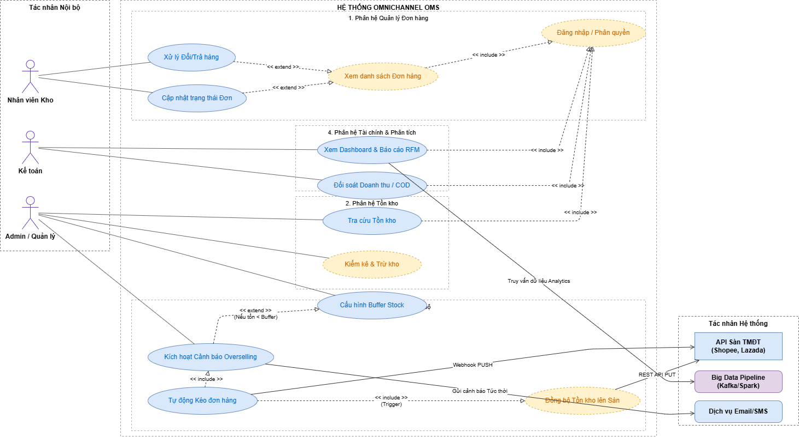
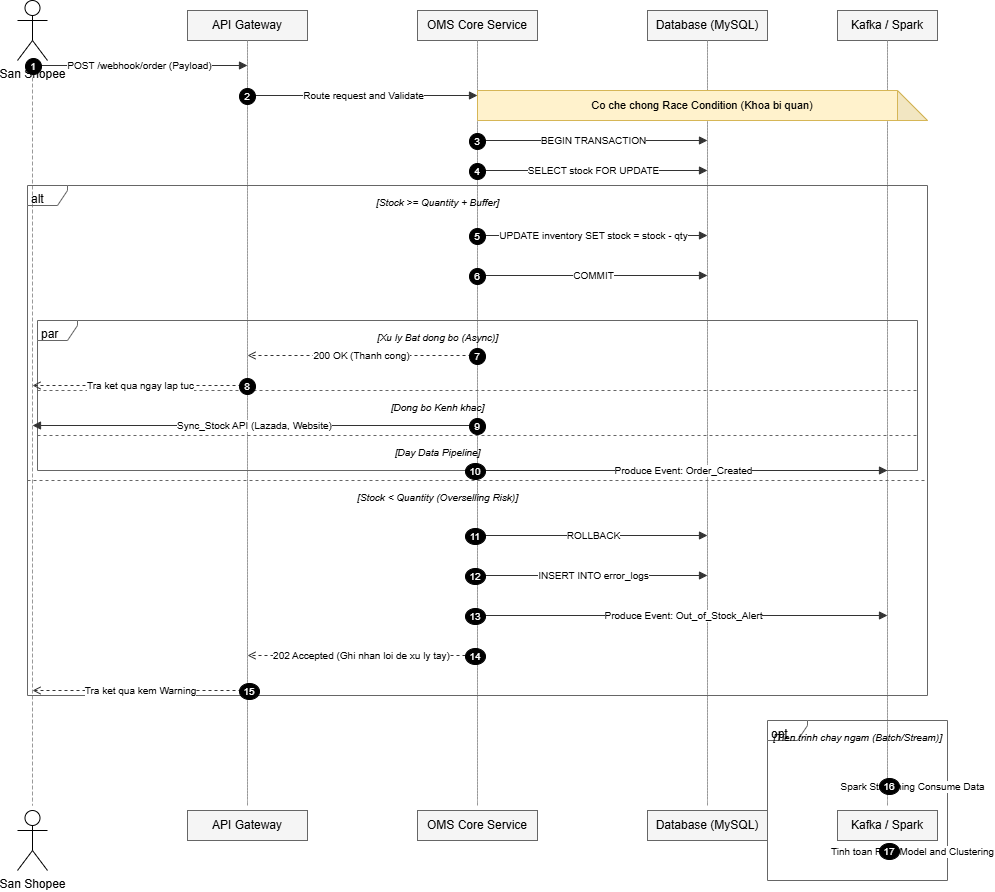
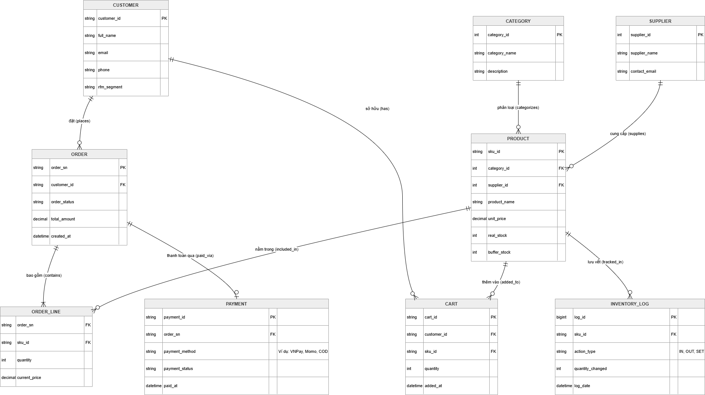

# OmniOMS — Hệ thống Quản lý Đơn hàng Đa kênh

### Giải pháp phân tích nghiệp vụ chống Overselling & đồng bộ tồn kho real-time

> 📁 Đồ án cá nhân — Portfolio Business Analyst Intern

---

## 📌 Giới thiệu

Doanh nghiệp bán hàng đồng thời trên nhiều sàn thương mại điện tử (Shopee, Lazada, Website) nhưng chỉ có một nguồn hàng vật lý duy nhất. Khi không có cơ chế đồng bộ tồn kho real-time, doanh nghiệp dễ gặp tình trạng **overselling** — nhận đơn vượt quá số lượng tồn thực tế — dẫn đến hủy đơn, ảnh hưởng uy tín shop trên sàn.

Dự án này mô phỏng vai trò Business Analyst trong việc khảo sát quy trình hiện tại, xác định vấn đề, và thiết kế giải pháp nghiệp vụ + dữ liệu cho một hệ thống OMS (Order Management System) đa kênh, với điểm nhấn là cơ chế **Buffer Stock** giúp cảnh báo rủi ro thiếu hàng *trước khi* xác nhận đơn.

## 🎯 Mục tiêu dự án

- Tự động hóa quy trình tiếp nhận đơn hàng và kiểm tra tồn kho real-time.
- Thiết lập cơ chế Buffer Stock để cảnh báo sớm rủi ro overselling.
- Đồng bộ tồn kho hai chiều giữa hệ thống trung tâm và các sàn TMĐT.
- Cung cấp dashboard vận hành và mô hình phân khúc khách hàng (RFM) hỗ trợ ra quyết định CRM.

## 🛠️ Phương pháp & Công cụ sử dụng

| Hạng mục | Phương pháp / Công cụ |
|---|---|
| Mô hình hóa quy trình | BPMN (As-is / To-be), draw.io |
| Phân tích yêu cầu | UML Use Case Diagram, Use Case Specification |
| Thiết kế dữ liệu | ERD (Entity Relationship Diagram) |
| Đặc tả kỹ thuật | UML Sequence Diagram |
| Phân tích khách hàng | RFM Analysis (mô hình K-Means, k=4) |
| Thiết kế giao diện | Wireframe / UI Mockup (HTML + Tailwind CSS) |
| Tài liệu hóa | Business Requirement & Analysis Document (BRD) — Word |

## 📂 Cấu trúc dự án

```
OmniOMS-BA-Project/
├── README.md
├── docs/
│   └── OmniOMS_BRD.docx          # Tài liệu BRD đầy đủ (10 phần, 22 trang)
├── diagrams/
│   ├── as-is.png                 # Quy trình hiện tại
│   ├── to-be.png                 # Quy trình đề xuất
│   ├── use-case.png              # Sơ đồ Use Case tổng quan
│   ├── erd.png                   # Sơ đồ thực thể liên kết
│   └── sequence.png              # Luồng xử lý đơn hàng real-time
└── mockups/
    ├── dashboard.html            # Màn hình vận hành tổng quan
    ├── analytics-rfm.html        # Màn hình phân tích RFM
    └── overselling-modal.html    # Màn hình xử lý ngoại lệ overselling
```

> 💡 Khi đưa lên repo, đổi tên các file ảnh/HTML gốc về đúng tên trong cấu trúc trên (hoặc chỉnh lại đường dẫn ảnh trong README cho khớp với tên file thực tế của bạn).

---

## 🔍 1. Quy trình As-is → To-be

**As-is:** Nhân viên kiểm tra tồn kho thủ công bằng cách đăng nhập từng sàn và gộp dữ liệu — dễ sai lệch số liệu, phát hiện thiếu hàng quá muộn (sau khi khách đã đặt).



**To-be:** Hệ thống tự động kiểm tra điều kiện `real_stock − quantity ≥ buffer_stock` ngay khi nhận đơn; nếu không đủ điều kiện, hệ thống tự ẩn sản phẩm trên sàn và cảnh báo Admin trước khi đơn được xác nhận.



📄 Chi tiết phân tích pain-point và business rule: xem mục 3–4 trong `docs/OmniOMS_BRD.docx`.

## 🗂️ 2. Use Case Diagram

11 use case được nhóm theo 4 phân hệ: Quản lý Đơn hàng, Tồn kho, Vận hành/Đồng bộ, Tài chính & Phân tích — với 3 nhóm actor nội bộ (Nhân viên Kho, Kế toán, Admin) và 3 actor hệ thống (API Sàn TMĐT, Big Data Pipeline, Dịch vụ Email/SMS).



📄 Đặc tả chi tiết từng use case (actor, luồng chính, luồng ngoại lệ): mục 5.2 trong BRD.

## 🗄️ 3. Mô hình dữ liệu (ERD)

9 thực thể chính: `CUSTOMER`, `ORDER`, `ORDER_LINE`, `PAYMENT`, `PRODUCT`, `CATEGORY`, `SUPPLIER`, `CART`, `INVENTORY_LOG`. Trọng tâm là hai trường `real_stock` và `buffer_stock` trong `PRODUCT`, làm nền tảng cho business rule chống overselling.



## 🔄 4. Sequence Diagram — Luồng xử lý đơn hàng real-time

Mô tả cách hệ thống xử lý webhook đơn hàng từ sàn Shopee, áp dụng **khóa bi quan (pessimistic lock)** để chống race condition khi nhiều đơn hàng cùng tranh chấp một SKU, cùng cơ chế rollback và ghi log khi phát hiện rủi ro overselling.



## 🖥️ 5. UI Mockup

| Màn hình | Mục đích nghiệp vụ |
|---|---|
| [`dashboard.html`](mockups/dashboard.html) | Giám sát luồng đơn hàng đa kênh real-time, highlight đơn lỗi buffer |
| [`analytics-rfm.html`](mockups/analytics-rfm.html) | Phân khúc khách hàng RFM, gợi ý hành động CRM theo từng nhóm |
| [`overselling-modal.html`](mockups/overselling-modal.html) | Xử lý ngoại lệ khi phát hiện overselling (đổi sản phẩm / hủy đơn có log) |

---

## 📄 Tài liệu đầy đủ

Bộ tài liệu BRD hoàn chỉnh (10 phần — Stakeholder Analysis, Use Case Specification, Non-Functional Requirements, Data Dictionary, UI Spec...) nằm tại:
👉 [`docs/OmniOMS_BRD.docx`](docs/OmniOMS_BRD.docx)

## ✅ Kết quả đạt được

- Bộ tài liệu phân tích nghiệp vụ đầy đủ, đóng vai trò cầu nối giữa yêu cầu kinh doanh và team kỹ thuật.
- Business rule rõ ràng (Buffer Stock) giải quyết trực tiếp bài toán overselling.
- Mô hình dữ liệu và luồng xử lý đủ chi tiết để chuyển giao triển khai.

## 🚀 Hướng phát triển tiếp theo

- Tích hợp thêm sàn TMĐT khác (TikTok Shop, Tiki) theo kiến trúc Adapter.
- Module dự báo nhu cầu (demand forecasting) để tối ưu Buffer Stock theo SKU/mùa vụ.
- Mở rộng mô hình RFM thành mô hình dự đoán rời bỏ khách hàng (churn prediction).

---

## 👤 Tác giả

**Lê Tấn Thành**
Business Analyst Intern
📧 thanh121265@gmail.com
